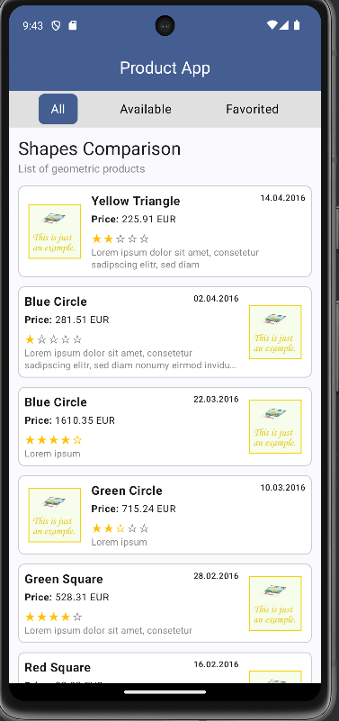
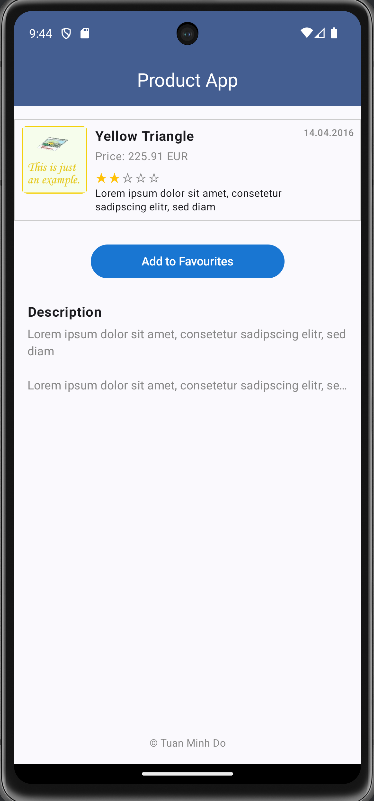
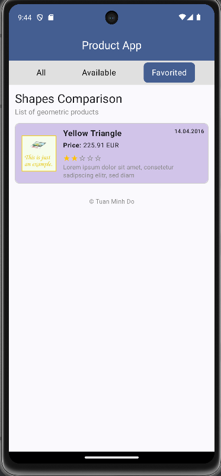
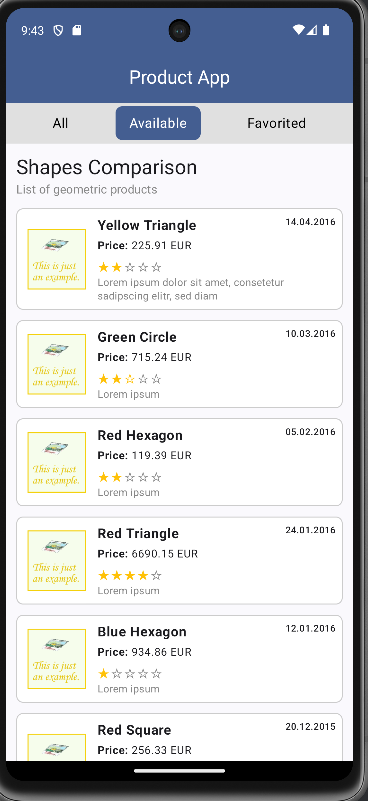
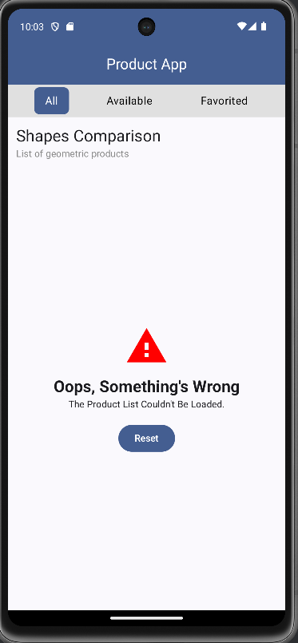

# ProductApp – Android Application

ProductApp is a personal project developed to strengthen my skills in Android application development using Kotlin, Jetpack Compose, and the MVVM architectural pattern. The app demonstrates the use of modern Android technologies to fetch and display product data from the public API provided by Check24, providing users with features such as filtering, favoriting, and detailed product views through a clean and responsive UI.

##  Application Features

### 1. Product Overview Screen
The main screen displays a list of products with the following features:
- Header section with title and subtitle loaded from API.
- Filter tabs: "All", "Available", "Favorited".
- Pull-to-refresh functionality.
- Dynamic product list using Jetpack Compose's `LazyColumn`.
- Display of AppFooter "© Tuan Minh Do"


### 2. Product Details Screen
Detailed view of a selected product:
- Image, name, price, rating, release date.
- Short and long descriptions.
- Toggle button to add/remove from favorites.
- If the product is added to the favorited list then the name will change to blue


### 3. Favorites Tab
Displays products marked as favorites.



### 4. Available Tab
Filters the list to show only products that are available.


### 5. Error Screen
When the app encounters a failure, an error screen is displayed with a clear message and a Reset button, allowing users to reload the product list without restarting the app.
To simulate real-world scenarios, an artificial error is triggered every 4th time the user refreshes the product list (i.e., after 3 successful refreshes). 


---

##  Project Structure

```
com.example.productapp/
├── data/
│   └── ProductAPI.kt                # Retrofit API setup
├── model/
│   ├── HeaderResponse.kt
│   ├── Product.kt
│   └── ProductResponse.kt          # API data models
├── navigation/
│   ├── AppNavigation.kt            # Compose Navigation graph
│   └── Nav.kt                      # Screen route definitions
├── ui/
│   ├── components/                 # Reusable UI components
│   ├── screens/                    # ProductOverview and ProductDetails screens
│   └── theme/                      # App theme settings
├── viewmodel/
│   └── ProductViewmodel.kt         # ViewModel managing UI state
└── MainActivity.kt                 # Entry point, sets up Compose content
```

---

## Technologies Used

- **Kotlin** – Core programming language
- **Jetpack Compose** – Modern declarative UI toolkit for Android
- **MVVM Architecture** – Separation of concerns using ViewModel
- **Retrofit** – HTTP client for making API requests to:
  ```
  https://app.check24.de/products-test.json
  ```
- **Coil** – Lightweight image loading for Jetpack Compose
- **Kotlin Coroutines** – Asynchronous state management

---

## Limitations

- Product images are currently hardcoded (static URL), though image URLs are expected in actual implementation.
- Favorite products are not persisted beyond app lifecycle (in-memory only).

---

## Getting Started

1. Clone the repository.
2. Open in Android Studio.
3. Sync Gradle and run the app on an emulator or device.

---

## License

This project is provided for educational and demonstration purposes

